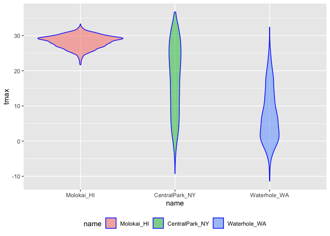
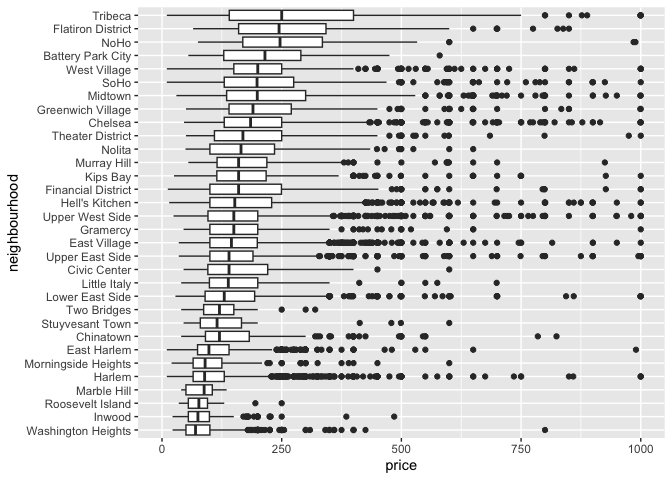

Strings and Factors
================

``` r
library(rvest)
library(tidyverse)
```

    ## ── Attaching core tidyverse packages ──────────────────────── tidyverse 2.0.0 ──
    ## ✔ dplyr     1.1.4     ✔ readr     2.1.5
    ## ✔ forcats   1.0.0     ✔ stringr   1.5.1
    ## ✔ ggplot2   3.5.2     ✔ tibble    3.3.0
    ## ✔ lubridate 1.9.4     ✔ tidyr     1.3.1
    ## ✔ purrr     1.1.0     
    ## ── Conflicts ────────────────────────────────────────── tidyverse_conflicts() ──
    ## ✖ dplyr::filter()         masks stats::filter()
    ## ✖ readr::guess_encoding() masks rvest::guess_encoding()
    ## ✖ dplyr::lag()            masks stats::lag()
    ## ℹ Use the conflicted package (<http://conflicted.r-lib.org/>) to force all conflicts to become errors

``` r
library(p8105.datasets)
```

## Strings and regex

Define string vector and filter specific value based on string variable
(case-sentitive)

``` r
string_vec = c("my", "name", "is", "jeff")

str_detect(string_vec, "jeff")
```

    ## [1] FALSE FALSE FALSE  TRUE

``` r
str_detect(string_vec, "e") 
```

    ## [1] FALSE  TRUE FALSE  TRUE

Replace string value and white space

``` r
str_replace(string_vec, "jeff", "Jeff")
```

    ## [1] "my"   "name" "is"   "Jeff"

``` r
str_replace(string_vec, "e", "")
```

    ## [1] "my"  "nam" "is"  "jff"

``` r
str_remove(string_vec, "m")
```

    ## [1] "y"    "nae"  "is"   "jeff"

Patterns matter when matching

``` r
string_vec = c(
  "i think we all rule for participating",
  "i think i have been caught",
  "i think this will be quite fun actually",
  "it will be fun, i think"
  )

str_detect(string_vec, "i think")
```

    ## [1] TRUE TRUE TRUE TRUE

``` r
str_detect(string_vec, "^i think")  # match with start with ""
```

    ## [1]  TRUE  TRUE  TRUE FALSE

``` r
str_detect(string_vec, "i think$")  # match with end with ""
```

    ## [1] FALSE FALSE FALSE  TRUE

``` r
str_detect(string_vec, "i think$")
```

    ## [1] FALSE FALSE FALSE  TRUE

`[]` anything inside counts for matching, and anything outside doesn’t
count

``` r
string_vec = c(
  "Time for a Pumpkin Spice Latte!",
  "went to the #pumpkinpatch last weekend",
  "Pumpkin Pie is obviously the best pie",
  "SMASHING PUMPKINS -- LIVE IN CONCERT!!"
  )

str_detect(string_vec,"[Pp]umpkin")
```

    ## [1]  TRUE  TRUE  TRUE FALSE

More complicated cases: number follows letter

``` r
string_vec = c(
  '7th inning stretch',
  '1st half soon to begin. Texas won the toss.',
  'she is 5 feet 4 inches tall',
  '3AM - cant sleep :('
  )

str_detect(string_vec, "^[0-9][a-zA-Z]") # detect any number between 0-9, A-Z, and a-z
```

    ## [1]  TRUE  TRUE FALSE  TRUE

``` r
string_vec = c(
  'Its 7:11 in the evening',
  'want to go to 7-11?',
  'my flight is AA711',
  'NetBios: scanning ip 203.167.114.66'
  )

str_detect(string_vec, "7.11") # . is a placeholder for anything between 7 and 11
```

    ## [1]  TRUE  TRUE FALSE  TRUE

``` r
str_detect(string_vec, "7\\.11") # indicates . is a special character trying to detect
```

    ## [1] FALSE FALSE FALSE  TRUE

Some characters are “special”. These include `[` and `]`, `(` and `)`,
and .. If you want to search for these, you have to indicate they’re
special using `\`. Unfortunately, `\` is also special, so things get
weird.

``` r
string_vec = c(
  'The CI is [2, 5]',
  ':-]',
  ':-[',
  'I found the answer on pages [6-7]'
  )

str_detect(string_vec, "\\[")
```

    ## [1]  TRUE FALSE  TRUE  TRUE

## Thoughts on factors

Default ordering is alphabatecial

``` r
vec_sex = factor(c("male", "male", "female", "female"))
vec_sex
```

    ## [1] male   male   female female
    ## Levels: female male

Force it to be numeric variable

``` r
as.numeric(vec_sex)
```

    ## [1] 2 2 1 1

``` r
vec_sex = fct_relevel(vec_sex, "male") 
vec_sex
```

    ## [1] male   male   female female
    ## Levels: male female

Reorder

``` r
vec_sex = fct_inorder(vec_sex)
vec_sex
```

    ## [1] male   male   female female
    ## Levels: male female

``` r
as.numeric(vec_sex)
```

    ## [1] 1 1 2 2

## NSDUH

Import from web

``` r
nsduh_url = "http://samhda.s3-us-gov-west-1.amazonaws.com/s3fs-public/field-uploads/2k15StateFiles/NSDUHsaeShortTermCHG2015.htm"

table_marj = 
  read_html(nsduh_url) |> 
  html_table() |> 
  first() |>
  slice(-1)
```

Tidy the dataset

``` r
data_marj = 
  table_marj |>
  select(-contains("P Value")) |>
  pivot_longer(
    -State,
    names_to = "age_year", 
    values_to = "percent") |>
  separate(age_year, into = c("age", "year"), sep = "\\(") |> # what to look for when separate: (
  mutate(
    year = str_replace(year, "\\)", ""), # remove also work, "\\)"
    percent = str_replace(percent, "[a-c]$", ""), # $ specifies only a-c letter
    percent = as.numeric(percent)) |>
  filter(!(State %in% c("Total U.S.", "Northeast", "Midwest", "South", "West"))) # !(State%in% c()) to delete those only
```

Make a quick plot

``` r
data_marj |>
  filter(age == "12-17") |> 
  mutate(State = fct_reorder(State, percent)) |> # mutate order just for plot, not for the whole dataset, so keep it here instead in the clean step.
  ggplot(aes(x = State, y = percent, color = year)) + 
    geom_point() + 
    theme(axis.text.x = element_text(angle = 90, hjust = 1))
```

<!-- -->

## Restaurant inspections

``` r
data("rest_inspec")

rest_inspec = 
    rest_inspec |> 
    rename(borough = boro)


rest_inspec |> 
  group_by(borough, grade) |> 
  summarize(n = n()) |> 
  pivot_wider(names_from = grade, values_from = n)
```

    ## `summarise()` has grouped output by 'borough'. You can override using the
    ## `.groups` argument.

    ## # A tibble: 6 × 9
    ## # Groups:   borough [6]
    ##   borough           A     B     C  `NA`     N     P     Z     G
    ##   <chr>         <int> <int> <int> <int> <int> <int> <int> <int>
    ## 1 0                33     9     6    67    NA    NA    NA    NA
    ## 2 Bronx         14071  2611   976 17190   161   236   605    NA
    ## 3 Brooklyn      38896  6423  2194 49825   345   782  1168     2
    ## 4 Manhattan     61675  9107  3600 76581   591   924  1816     3
    ## 5 Queens        36258  5526  1996 44136   350   604  1287    NA
    ## 6 Staten Island  5410   855   248  6315    71    61   116    NA

Only Include A/B/C grade

``` r
rest_inspec =
  rest_inspec |>
  filter(grade %in% c("A", "B", "C"), borough != "Missing") |> 
  mutate(borough = str_to_title(borough))

rest_inspec
```

    ## # A tibble: 189,894 × 26
    ##       camis dba        borough building street zipcode phone cuisine_description
    ##       <dbl> <chr>      <chr>   <chr>    <chr>    <dbl> <chr> <chr>              
    ##  1 41308044 RELISH CO… Manhat… 0        INSID…   10000 2127… American           
    ##  2 50038906 LE PAIN Q… Manhat… NKA      CENTR…   10000 2123… French             
    ##  3 41308044 RELISH CO… Manhat… 0        INSID…   10000 2127… American           
    ##  4 50038906 LE PAIN Q… Manhat… NKA      CENTR…   10000 2123… French             
    ##  5 50038906 LE PAIN Q… Manhat… NKA      CENTR…   10000 2123… French             
    ##  6 41308044 RELISH CO… Manhat… 0        INSID…   10000 2127… American           
    ##  7 41308044 RELISH CO… Manhat… 0        INSID…   10000 2127… American           
    ##  8 41308044 RELISH CO… Manhat… 0        INSID…   10000 2127… American           
    ##  9 50038906 LE PAIN Q… Manhat… NKA      CENTR…   10000 2123… French             
    ## 10 41308044 RELISH CO… Manhat… 0        INSID…   10000 2127… American           
    ## # ℹ 189,884 more rows
    ## # ℹ 18 more variables: inspection_date <dttm>, action <chr>,
    ## #   violation_code <chr>, violation_description <chr>, critical_flag <chr>,
    ## #   score <dbl>, record_date <dttm>, inspection_type <chr>, latitude <dbl>,
    ## #   longitude <dbl>, community_board <dbl>, council_district <chr>,
    ## #   census_tract <chr>, bin <dbl>, bbl <dbl>, nta <chr>, grade <chr>,
    ## #   grade_date <dttm>

Look for Pizza place

``` r
rest_inspec |> 
  filter(str_detect(dba, "Pizza")) |> 
  group_by(borough, grade) |> 
  summarize(n = n()) |> 
  pivot_wider(names_from = grade, values_from = n)
```

    ## `summarise()` has grouped output by 'borough'. You can override using the
    ## `.groups` argument.

    ## # A tibble: 4 × 3
    ## # Groups:   borough [4]
    ##   borough       A     B
    ##   <chr>     <int> <int>
    ## 1 Bronx        15     3
    ## 2 Brooklyn     15    NA
    ## 3 Manhattan    13     3
    ## 4 Queens       11     4

``` r
rest_inspec |> 
  filter(str_detect(dba, "[Pp][Ii][Zz][Zz][Aa]")) |> #any possible combination for those letters in the []
  group_by(borough, grade) |> 
  summarize(n = n()) |> 
  pivot_wider(names_from = grade, values_from = n)
```

    ## `summarise()` has grouped output by 'borough'. You can override using the
    ## `.groups` argument.

    ## # A tibble: 5 × 4
    ## # Groups:   borough [5]
    ##   borough           A     B     C
    ##   <chr>         <int> <int> <int>
    ## 1 Bronx          1201   261    98
    ## 2 Brooklyn       1919   291    95
    ## 3 Manhattan      2091   400    96
    ## 4 Queens         1695   239    78
    ## 5 Staten Island   328    60    15

Make a plot instead

``` r
rest_inspec |> 
  filter(str_detect(dba, "[Pp][Ii][Zz][Zz][Aa]")) |>
  ggplot(aes(x = borough, fill = grade)) + 
  geom_bar() 
```

<!-- -->

``` r
rest_inspec |> 
  filter(str_detect(dba, "[Pp][Ii][Zz][Zz][Aa]")) |>
  mutate(borough = fct_infreq(borough)) |> # order the bars according to frequency
  ggplot(aes(x = borough, fill = grade)) + 
  geom_bar() 
```

<!-- -->

``` r
rest_inspec |> 
  filter(str_detect(dba, "[Pp][Ii][Zz][Zz][Aa]")) |>
  mutate(
    borough = fct_infreq(borough), #convert string variables to factor
    borough = str_replace(borough, "Manhattan", "The City")) |> # replace names, and convert back to strings, then the order change to alphabetical
  ggplot(aes(x = borough, fill = grade)) + 
  geom_bar() 
```

<!-- -->

`replace` to rename.

``` r
rest_inspec |> 
  filter(str_detect(dba, "[Pp][Ii][Zz][Zz][Aa]")) |>
  mutate(
    borough = fct_infreq(borough),
    borough = replace(borough, which(borough == "Manhattan"), "The City")) |>
  ggplot(aes(x = borough, fill = grade)) + 
  geom_bar()
```

    ## Warning: There was 1 warning in `mutate()`.
    ## ℹ In argument: `borough = replace(borough, which(borough == "Manhattan"), "The
    ##   City")`.
    ## Caused by warning in `[<-.factor`:
    ## ! invalid factor level, NA generated

<!-- -->
Not work at all. Factors have very specific values, trying to use a
value that is not an existing factor level won’t work.

Use `fct_recode` to directly rename factor levels

``` r
rest_inspec |> 
  filter(str_detect(dba, regex("pizza", ignore_case = TRUE))) |>
  mutate(
    borough = fct_infreq(borough),
    borough = fct_recode(borough, "The City" = "Manhattan")) |>
  ggplot(aes(x = borough, fill = grade)) + 
  geom_bar()
```

<!-- -->

## Weather Data

``` r
library(p8105.datasets)
data("weather_df")
```

Reordered name “by hand” using `fct_relevel`:

``` r
weather_df |>
  mutate(name = forcats::fct_relevel(name, c("Molokai_HI", "CentralPark_NY", "Waterhole_WA"))) |> 
  ggplot(aes(x = name, y = tmax)) + 
  geom_violin(aes(fill = name), color = "blue", alpha = .5) + 
  theme(legend.position = "bottom")
```

    ## Warning: Removed 17 rows containing non-finite outside the scale range
    ## (`stat_ydensity()`).

<!-- -->

Reorder name according to tmax values in each name using `fct_reorder`:

``` r
weather_df |>
  mutate(name = forcats::fct_reorder(name, tmax)) |> 
  ggplot(aes(x = name, y = tmax)) + 
  geom_violin(aes(fill = name), color = "blue", alpha = .5) + 
  theme(legend.position = "bottom")
```

    ## Warning: There was 1 warning in `mutate()`.
    ## ℹ In argument: `name = forcats::fct_reorder(name, tmax)`.
    ## Caused by warning:
    ## ! `fct_reorder()` removing 17 missing values.
    ## ℹ Use `.na_rm = TRUE` to silence this message.
    ## ℹ Use `.na_rm = FALSE` to preserve NAs.

    ## Warning: Removed 17 rows containing non-finite outside the scale range
    ## (`stat_ydensity()`).

<!-- -->
Ordering of factor variables play an important role for linear
regression, the ordering determines the “reference” category

``` r
weather_df |>
  lm(tmax ~ name, data = _)
```

    ## 
    ## Call:
    ## lm(formula = tmax ~ name, data = weather_df)
    ## 
    ## Coefficients:
    ##      (Intercept)    nameMolokai_HI  nameWaterhole_WA  
    ##            17.66             10.66            -10.28

Change the reference group by `fct_relevel` for regression

``` r
weather_df |>
  mutate(name = forcats::fct_relevel(name, c("Molokai_HI", "CentralPark_NY", "Waterhole_WA"))) |> 
  lm(tmax ~ name, data = _)
```

    ## 
    ## Call:
    ## lm(formula = tmax ~ name, data = mutate(weather_df, name = forcats::fct_relevel(name, 
    ##     c("Molokai_HI", "CentralPark_NY", "Waterhole_WA"))))
    ## 
    ## Coefficients:
    ##        (Intercept)  nameCentralPark_NY    nameWaterhole_WA  
    ##              28.32              -10.66              -20.94

## Pulse Data

``` r
pulse_data = 
  haven::read_sas("./data/public_pulse_data.sas7bdat") |>
  janitor::clean_names() |>
  pivot_longer(
    bdi_score_bl:bdi_score_12m,
    names_to = "visit", 
    names_prefix = "bdi_score_",
    values_to = "bdi") |>
  select(id, visit, everything()) |>
  mutate(
    visit = str_replace(visit, "bl", "00m"),
    visit = factor(visit)) |>
  arrange(id, visit)

print(pulse_data, n = 12)
```

    ## # A tibble: 4,348 × 5
    ##       id visit   age sex     bdi
    ##    <dbl> <fct> <dbl> <chr> <dbl>
    ##  1 10003 00m    48.0 male      7
    ##  2 10003 01m    48.0 male      1
    ##  3 10003 06m    48.0 male      2
    ##  4 10003 12m    48.0 male      0
    ##  5 10015 00m    72.5 male      6
    ##  6 10015 01m    72.5 male     NA
    ##  7 10015 06m    72.5 male     NA
    ##  8 10015 12m    72.5 male     NA
    ##  9 10022 00m    58.5 male     14
    ## 10 10022 01m    58.5 male      3
    ## 11 10022 06m    58.5 male      8
    ## 12 10022 12m    58.5 male     NA
    ## # ℹ 4,336 more rows

## Airbnb

``` r
data("nyc_airbnb")

nyc_airbnb |>
  filter(neighbourhood_group == "Manhattan") |> 
  mutate(
    neighbourhood = fct_reorder(neighbourhood, price)) |> 
  ggplot(aes(x = neighbourhood, y = price)) +
  geom_boxplot() +
  coord_flip() + 
  ylim(0, 1000)
```

    ## Warning: Removed 109 rows containing non-finite outside the scale range
    ## (`stat_boxplot()`).

<!-- -->
